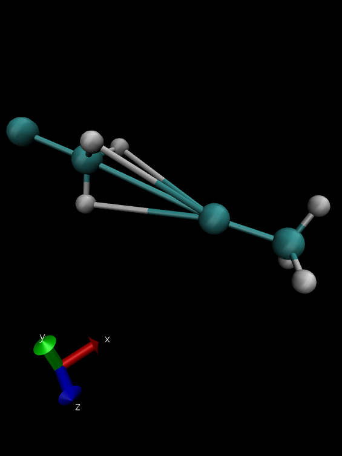
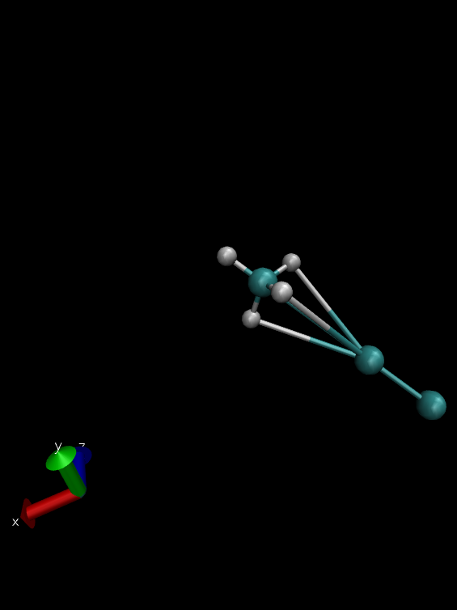
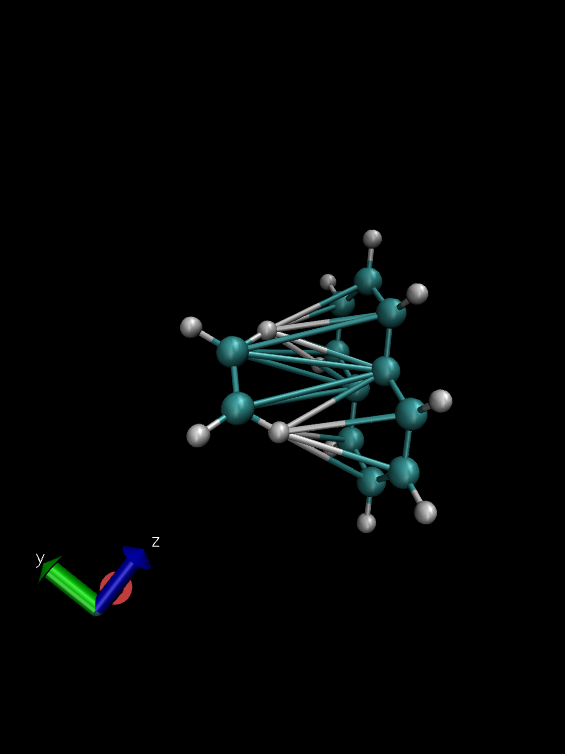
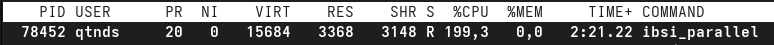
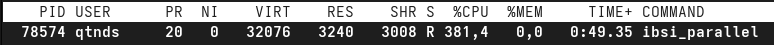

# CHPS 1002, TP2 : Analyse des Liaisons Moléculaires par IBSI

## Attention !
Il y a deux Makefile, un sans la version GPU et un avec la version GPU (Makefile1). Lors de l'utilisation de ```make```, ce sera sans la version GPU.

J'ai décidé de laisser la version GPU car je la pense correct au niveau du code mais je n'ai pas pu la tester. J'ai installé ```nvfortran``` mais il y a des problèmes entre la compatibilité de mon OS et la version de CUDA requise par ma carte graphique. ```nvfortran``` n'a pas réussi à s'en sortir. Donc je laisse ma versino GPU au cas où elle fonctionnerait sur vos machines.

## Introduction

Ce projet permet de calculer l'**Interaction Bond Strength Indicator (IBSI)** à partir d'un fichier `.wfx` obtenu d'un calcul quantique. Le programme Fortran calcule la densité électronique atomique de Slater sur une grille 3D, intègre un critère différentiel pour chaque paire d'atomes, et détermine automatiquement la connectivité moléculaire (liaisons covalentes et non-covalentes). Un script Python permet ensuite de visualiser les résultats.

## Fichiers du projet

```
.
├── ibsi.f90               # Version séquentielle
├── ibsi_parallel.f90      # Version parallèle OpenMP
├── ibsi_gpu.f90           # Version GPU (DO CONCURRENT)
├── ibsi_bash              # Script bash unifié pour lancer les 3 versions
├── visualize.py           # Visualisation Python des résultats
├── Makefile               # Compilation des 3 exécutables
├── exemples_arbre_molecule/
│   ├── 1_dimer/
│   │   ├── mol.wfx
│   │   └── mol.xyz
│   ├── 2_dimer/
│   │   ├── mol.wfx
│   │   └── mol.xyz
│   ├── 3_dimer/
│   │   ├── mol.wfx
│   │   └── mol.xyz
│   ├── 1/
│   │   ├── mol.wfx
│   │   └── mol.xyz
│   └── etc ...
└── resultats/
    ├── covalente/         # Captures des liaisons covalentes (3 exemples)
    ├── non_covalente/     # Captures des liaisons non-covalentes (3 exemples)
    ├── histogramme/       # histogramme des seuillages de valeurs de IBSI
    └── openmp/            # Captures htop / CPU usage (3 captures)
```

---

## Installation et compilation

Cloner le dépôt :
```bash
git https://github.com/qtnds/CHPS1002.git
```

Compiler les trois versions :
```bash
make
```

Cela génère les exécutables `ibsi`, `ibsi_parallel` et `ibsi_gpu`.

Installer les dépendances Python :
```bash
pip install numpy matplotlib
```

---

## Lancement : `ibsi_bash`

Un script bash unifié `ibsi_bash` permet de lancer indifféremment la version séquentielle, OpenMP ou GPU sans avoir à se souvenir des noms d'exécutables. Il accepte un premier argument de mode (`seq`, `omp` ou `gpu`), puis transmet le reste des arguments à l'exécutable correspondant. En fin d'exécution, il lance automatiquement VMD pour visualiser la molécule générée.

```bash
# Version séquentielle
./ibsi_bash seq --input <dossier> [--seuil1 <valeur>] [--seuil2 <valeur>]

# Version OpenMP avec 4 threads
./ibsi_bash omp 4 --input <dossier> [--seuil1 <valeur>] [--seuil2 <valeur>]

# Version GPU
./ibsi_bash gpu --input <dossier> [--seuil1 <valeur>] [--seuil2 <valeur>]
```

| Argument    | Obligatoire | Description                                       |
|-------------|:-----------:|---------------------------------------------------|
| `--input`   | ✔           | Chemin vers le dossier contenant `mol.wfx`        |
| `--seuil1`  |             | Seuil IBSI pour liaisons covalentes (déf. 0.05)   |
| `--seuil2`  |             | Seuil IBSI pour liaisons non-covalentes (déf. 0.02)|


Par exemple :
``` ./ibsi_bash seq --input exemples_arbre_molecule/8 --seuil1 0.05 --seuil2 0.001 ```
---

## Méthode IBSI

La densité électronique atomique de chaque atome est modélisée par une somme de trois fonctions de Slater :

$$\rho_A(r) = a_1 e^{-b_1 r} + a_2 e^{-b_2 r} + a_3 e^{-b_3 r}$$

où les coefficients $a_i$ et $b_i$ sont tabulés pour les éléments Z = 1 à Z = 54.

L'indice IBSI entre deux atomes A et B est défini par :

$$\text{IBSI}_{AB} = \frac{1}{d_{AB}^2} \int \left( \|\nabla\rho_A\| + \|\nabla\rho_B\| - \|\nabla\rho_A + \nabla\rho_B\| \right) dV$$

L'intégrande mesure la différence entre la somme des normes des gradients proatomiques et la norme de leur somme vectorielle. Cette quantité est non nulle uniquement dans les régions où les deux densités se "chevauchent" de façon cohérente, c'est-à-dire là où existe une véritable interaction. Plus l'IBSI est grand, plus la liaison est forte.

### Paramètres de la grille

| Paramètre    | Valeur par défaut | Description                          |
|--------------|:-----------------:|--------------------------------------|
| `eps`        | 5.0 bohr          | Marge autour de la boîte des atomes  |
| `dx`         | 0.3 bohr          | Pas de la grille                     |
| `--seuil1`   | 0.05              | Seuil IBSI pour liaison covalente    |
| `--seuil2`   | 0.02              | Seuil IBSI pour liaison non-covalente|

---

## `ibsi.f90` — Version séquentielle

### Description

`ibsi.f90` est le programme de référence. Il lit le fichier `mol.wfx`, construit une grille 3D autour de la molécule, puis calcule pour chaque paire d'atomes (A, B) l'indice IBSI par intégration numérique. La complexité algorithmique est en **O(N² × Ngrille)**, ce qui devient coûteux dès que la molécule compte plus d'une dizaine d'atomes.


### Passe 1 — Liaisons covalentes

Pour chaque paire d'atomes (A, B), le programme intègre l'intégrande IBSI sur l'ensemble de la grille 3D. Si la valeur obtenue dépasse `seuil1`, la paire est marquée comme liaison covalente. En fin de passe, un graphe de connectivité est construit et les fragments moléculaires sont identifiés par un algorithme de parcours en largeur (BFS). Cette étape est **toujours exécutée**, quelle que soit la molécule.

### Passe 2 — Liaisons non-covalentes (intermoléculaires)

La passe 2 est **optionnelle** et ne se déclenche que si deux conditions sont réunies : la molécule contient au moins deux fragments distincts (détectés en passe 1), **et** un fichier `mol.xyz` existe dans le dossier avec une ligne de métadonnées précisant les fragments :

```
<nb_atomes>
selection_a: 1-6 selection_b: 7-12
...coordonnées...
```

Le programme calcule alors uniquement les paires inter-fragments (A ∈ fragment 1, B ∈ fragment 2) dont l'IBSI est difficile a définir et peut s'avérer être plus petite que d'autres laison. Ces interactions correspondent typiquement aux liaisons hydrogène, liaisons de van der Waals ou interactions halogène.

Ce qui fausse le résultat est la prise en compte des liaisons intra-fragment donc on les retire pour avoir des ordres de grandeurs différents. Il est possible de régler le seuil de manière empirique car si des fragments sont captés dans les fichiers, alors on procède à un affichage de toutes les valeurs. On observe que dans les molécules fournies, les liaisons covalentes ont un seuil supérieur à 0.001. 

Voici un exemple pour la molécule 8 de ce qui est affiché dans le terminal.
```
 Seuil pour liaisons non-covalentes (--seuil2):    1.0000000000000000E-003
 
 Atome_A    Atome_B    Distance(bohr)    IBSI      Liaison NC?
 --------------------------------------------------------------
        C1         C7     9.0122        0.000198    NON
        C1         C8     9.0168        0.000192    NON
        C1         C9     8.0955        0.000498    NON
        C1        C10     7.0092        0.001538    OUI
 ......
        C1        H24     8.9489        0.000083    NON
        C2         C7     7.6344        0.000838    NON
        C2         C8     7.6373        0.000827    NON
        C2         C9     7.3299        0.001040    OUI
        C2        C10     7.0038        0.001437    OUI
        C2        C11     8.0876        0.000471    NON
        C2        C12     9.0091        0.000193    NON
        C2        C13     9.0069        0.000179    NON
        C2        C14     8.0826        0.000430    NON
        C2        C15     7.0007        0.001391    OUI
        C2        C16     7.3240        0.001086    OUI
        C2        H17     8.7632        0.000105    NON
        C2        H18     8.7677        0.000103    NON
        C2        H19     8.2800        0.000158    NON
......
        H3        H22     9.6704        0.000015    NON
        H3        H23     9.6830        0.000016    NON
        H3        H24    10.7450        0.000006    NON
        H4         C7     8.6306        0.000117    NON
        H4         C8     8.6380        0.000110    NON
        H4         C9     7.3516        0.000420    NON
        H4        C10     5.7053        0.002549    OUI
        H4        C11     5.6773        0.002256    OUI
        H4        C12     5.6547        0.002413    OUI
        H4        C13     5.6439        0.002234    OUI
        H4        C14     5.6558        0.002428    OUI
        H4        C15     5.6942        0.002617    OUI
        H4        C16     7.3347        0.000434    NON
        H4        H17    10.2816        0.000009    NON
        H4        H18    10.2924        0.000008    NON
......
        H4        H23     6.8369        0.000312    NON
        H4        H24     8.2765        0.000065    NON
        H5         C7     8.8781        0.000100    NON
        H5         C8     8.8782        0.000098    NON
        H5         C9     8.8890        0.000090    NON
        H5        C10     8.9116        0.000088    NON
        H5        C11    10.0370        0.000028    NON
        H5        C12    11.0134        0.000011    NON
......
        H5        H18     9.6696        0.000018    NON
        H5        H19     9.6841        0.000016    NON
        H5        H20    10.7453        0.000005    NON
        H5        H21    12.3473        0.000001    NON
......
        H5        H24     9.6840        0.000016    NON
        H6         C7     5.6461        0.002753    OUI
        H6         C8     5.6510        0.002702    OUI
        H6         C9     5.6663        0.002286    OUI
        H6        C10     5.6928        0.002321    OUI
        H6        C11     7.3361        0.000448    NON
        H6        C12     8.6240        0.000124    NON
        H6        C13     8.6211        0.000115    NON
        H6        C14     7.3291        0.000397    NON
        H6        C15     5.6881        0.002129    OUI
        H6        C16     5.6568        0.002429    OUI
        H6        H17     6.8278        0.000324    NON
        H6        H18     6.8349        0.000319    NON
        H6        H19     6.8554        0.000277    NON
......
        H6        H24     6.8415        0.000311    NON
```

### Fichiers de sortie

| Fichier            | Contenu                                                          |
|--------------------|------------------------------------------------------------------|
| `ibsi_results.dat` | Matrice complète des indices IBSI avec type de liaison (0/1/2)  |
| `molecule.pdb`     | Structure moléculaire avec connectivité, visualisable dans VMD  |

---

## `ibsi_parallel.f90` — Version OpenMP

### Description

`ibsi_parallel.f90` est identique à `ibsi.f90` dans sa logique (mêmes deux passes, mêmes arguments, mêmes fichiers de sortie), mais la boucle de calcul de la matrice IBSI est parallélisée avec **OpenMP**.

### Ce qui a été parallélisé — et pourquoi

Le goulot d'étranglement du programme séquentiel est la double boucle sur les paires d'atomes (A, B), chacune nécessitant une intégration complète sur l'ensemble de la grille 3D. Ce calcul représente typiquement plus de 99 % du temps total.

La stratégie choisie est de paralléliser la **boucle externe sur les paires (A, B)** plutôt que la triple boucle interne (i, j, k). Les raisons sont :

- Chaque paire est **totalement indépendante** des autres → aucun conflit d'écriture sur `ibsi_matrix(a,b)`, pas besoin de section critique.
- La triple boucle interne est déjà efficacement exécutée par un seul thread grâce au cache L1/L2 — la fragmenter entre plusieurs threads introduirait plus d'overhead que de gain.
- `SCHEDULE(DYNAMIC,1)` est utilisé car les paires proches ont des distances `d_ab` faibles et convergent plus vite que les paires éloignées → équilibrage de charge dynamique.

La paire d'atomes est restructurée en une **liste linéaire** `ipair = 1..npairs` pour pouvoir appliquer un `PARALLEL DO` propre sur un seul niveau de boucle.

```bash
# Compilation
gfortran -O2 -fopenmp -o ibsi_parallel ibsi_parallel.f90

# Exécution
./ibsi_bash omp 4 --input exemples_arbre_molecule/1_dimer --seuil1 0.05 --seuil2 0.001
```

### Résultats (CPU : Intel Core i5 — 7e génération, 2 cœurs physiques / 4 threads)

L'i5 de 7e génération est un processeur de bureau modeste : 2 cœurs physiques avec Hyper-Threading donnent 4 threads logiques au maximum. Le gain de parallélisme est donc intrinsèquement limité, d'autant que le Hyper-Threading partage les unités de calcul flottant entre les deux threads logiques d'un même cœur physique.

| Threads | Temps (s)   | Speedup | Efficacité |
|:-------:|:-----------:|:-------:|:----------:|
| 1 (séq) | 2m 26.8s    | 1.0×    | 100 %      |
| 2       | 1m 45.2s    | 1.40×   | 70 %       |
| 4       | 0m 46.5s    | 3.15×   | 79 %       |

Le speedup sous-linéaire s'explique par la **loi d'Amdahl** : les phases non parallélisées (lecture WFX, écriture PDB/DAT, identification des fragments) constituent un overhead fixe qui plafonne le gain global. Pour des petites molécules avec peu de paires d'atomes, cet overhead peut même dépasser le gain de calcul — la version parallèle est surtout bénéfique au-delà de 20 atomes.

On observe par ailleurs dans `resultats/openmp/` que l'utilisation CPU passe de ~100 % (1 thread) à ~200 % (2 threads) puis ~381 % (4 threads), ce qui confirme que les 4 threads logiques sont bien activés.

---

## `ibsi_gpu.f90` — Version GPU (DO CONCURRENT)

### Description

`ibsi_gpu.f90` reprend la même logique qu'`ibsi.f90` mais remplace la boucle de calcul par deux niveaux de **`DO CONCURRENT`** (Fortran 2018/2023), le mécanisme standard de parallélisme GPU en Fortran moderne. Le compilateur NVIDIA `nvfortran` traduit automatiquement ces boucles en noyaux CUDA sans qu'il soit nécessaire d'écrire une seule ligne de code CUDA à la main.

### Ce qui a été parallélisé — et pourquoi

Deux niveaux de parallélisme sont exploités simultanément :

**Niveau 1 — Paires (A, B)** via `DO CONCURRENT (ipair = 1:npairs) LOCAL(...)` : chaque paire constitue une tâche GPU indépendante. La clause `LOCAL(...)` déclare toutes les variables intermédiaires locales à la paire, ce qui les place en **registres GPU** — accès sans latence mémoire.

**Niveau 2 — Grille 3D** via `DO CONCURRENT (igrid = 1:ngrid) REDUCE(+:dg_sum)` : la triple boucle (i, j, k) est aplatie en un seul indice linéaire `igrid = 1..nx×ny×nz`. Cet aplatissement expose directement les `nx×ny×nz` points à autant de threads GPU en une seule passe, maximisant l'*occupancy* (taux d'occupation des multiprocesseurs). La clause `REDUCE(+:dg_sum)` (Fortran 2023) génère une réduction atomique GPU native (`atomicAdd` en CUDA), très efficace en double précision sur les GPU NVIDIA modernes.

Toutes les fonctions appelées dans le `DO CONCURRENT` sont déclarées **`PURE`**, ce qui est obligatoire selon le standard Fortran mais aussi bénéfique : `nvfortran` les inline directement dans le noyau CUDA, éliminant tout overhead d'appel de sous-programme sur le device. Les coefficients de Slater issus des tableaux `PARAMETER` sont résolus à la compilation et atterrissent en registres GPU.

### Compilation et exécution

```bash
# NVIDIA GPU (recommandé)
nvfortran -O3 -stdpar=gpu -o ibsi_gpu ibsi_gpu.f90

# Fallback CPU multicore (sans GPU)
nvfortran -O3 -stdpar=multicore -o ibsi_gpu ibsi_gpu.f90

# Lancement
./ibsi_bash gpu --input exemples_arbre_molecule/1_dimer --tseq 146.8 --tpar 46.5
```

L'option `--tseq` permet de passer le temps séquentiel de référence (en secondes) pour que le programme calcule et affiche automatiquement le speedup GPU vs séquentiel. L'option `--tpar` fait de même par rapport à la version OpenMP.

### Résultats (GPU : NVIDIA GeForce GTX 950)

La GTX 950 est un GPU de milieu de gamme (2015) basé sur l'architecture Maxwell. Elle dispose de 768 cœurs CUDA et de 2 Go de GDDR5, avec un débit mémoire de 105 Go/s et des performances double précision limitées (~53 GFLOP/s FP64, soit 1/32e des performances FP32). Le calcul IBSI étant intensif en FP64 (exponentielles et racines carrées), ce GPU n'est pas dans son domaine d'excellence. Je n'ai tout de même pas pu faire la pratique car j'ai des gros soucis de dépendances comme dis dans la toutes première section.

| Version       | Temps       | Speedup vs séq. | Speedup vs OpenMP |
|:-------------:|:-----------:|:---------------:|:-----------------:|
| Séquentiel    | *à compléter* | 1.0×           | —                 |
| OpenMP 4T     | *à compléter* | *à compléter*  | 1.0×              |
| GPU GTX 950   | *à compléter* | *à compléter*  | *à compléter*     |

> **Note :** Les valeurs de cette table seront complétées après exécution sur une machine qui possède un nvfortran fonctionnel.

---

## Visualisation Python

```bash
python visualize.py
```
Une figure présentant deux histogrammes, un pour la première passe et un pour la seconde passe permettant de justifier les choix de seuil et a différences entre les deux passes. *(VOIR SECTION CONCERNÉES).

## Visualisation VMD

```bash
vmd molecule.pdb
```

Les liaisons covalentes apparaissent en trait plein. Les liaisons non-covalentes (hydrogène, van der Waals) sont représentées en pointillés dans VMD si elles ont été enregistrées dans le fichier PDB via la passe 2.

---

## Résultats

### Liaisons covalentes (`resultat/covalente/`)

Les trois captures suivantes illustrent la détection automatique des liaisons covalentes sur les dimères fournis.

| 1\_dimer | 2\_dimer | 3\_dimer |
|:--------:|:--------:|:--------:|
|  |  |  |

### Liaisons non-covalentes (`resultat/non_covalente/`)

Les liaisons intermoléculaires (passe 2) détectées entre les deux fragments de chaque dimère.

| Exemple 1 | Exemple 2 | Exemple 3 |
|:---------:|:---------:|:---------:|
|  |  |  |

### Histogramme des liaisons (`resultat/histogramme/`)

Sur la figure ci-dessus il est possible de voir que les deux passes sont nécessaires. Les liaisons non covalente ne sont pas déterminable via un seul seuil et possède des IBSI basses. La deuxième passe permet de mieux les identifier car ils sont comparés à des choses simalaires.

### Utilisation CPU OpenMP (`resultat/openmp/`)

Captures `htop` montrant l'évolution de l'occupation CPU selon le nombre de threads. On passe de ~100 % (séquentiel) à ~200 % (2 threads) puis ~381 % (4 threads), confirmant l'activation effective du parallélisme sur les 4 threads logiques de l'i5 7e génération.

| 1 thread (~100 %) | 2 threads (~200 %) | 4 threads (~381 %) |
|:-----------------:|:------------------:|:------------------:|
|  |  |  |

---

## Remarques

- Le fichier `mol.wfx` doit contenir les sections `<Number of Nuclei>`, `<Nuclear Cartesian Coordinates>` et `<Atomic Numbers>`.
- Les éléments au-delà de Z = 54 ne sont pas pris en charge (coefficients de Slater non disponibles).
- Augmenter `eps` ou diminuer `dx` améliore la précision au détriment du temps de calcul.
- La complexité est en **O(N² × Ngrille)** : le calcul devient long dès 15+ atomes en version séquentielle.
- Pour `ibsi_gpu.f90`, la clause `REDUCE(+:dg_sum)` nécessite `nvfortran >= 23.1` ou `ifx >= 2024.1`. Avec `gfortran`, le code compile et s'exécute correctement mais de façon séquentielle (pas de GPU).